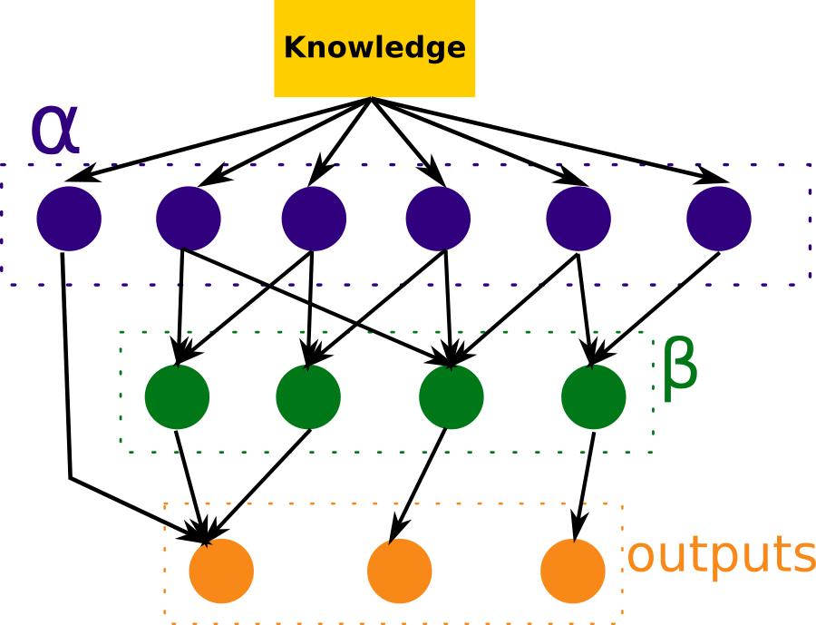
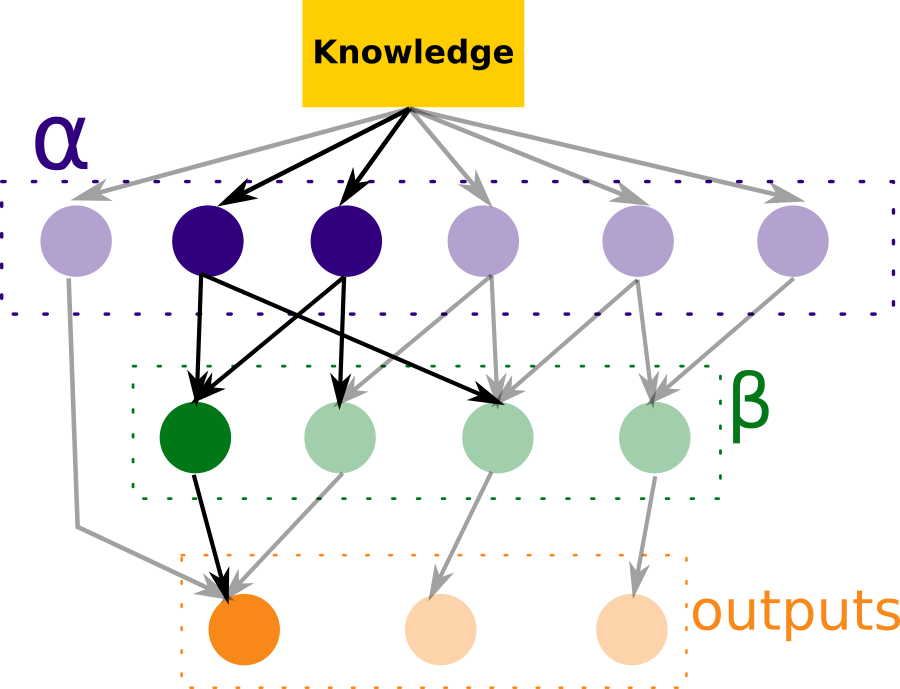
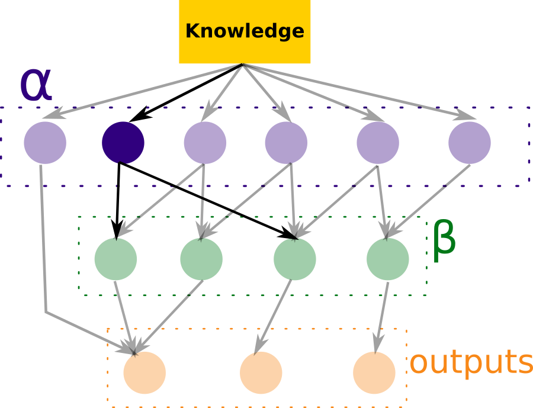

# RETE
Simple Flask backend server with RETE algorithm implementation that allows the loading
of custom rules.

## How it works
This algorithm uses three different layers: the Alpha Memory, the Beta Memory and the
outputs. When information (called Knowledge) is received, the nodes in both the Alpha
and Beta memories evaluate it in order to activate a node in the output layer, which
contains an inference result for the current knowledge.

If we wanted to draw this architecture, it would be something like this:



As the diagram shows, the Beta Memory evaluates the state of the nodes stored in the
Alpha Memory; this means that to enable beta nodes, it is necessary to first enable
all it's related alpha nodes. Another important thing to note from this diagram is 
that both alpha nodes and beta nodes can activate an output node, meaning that the
use of the Beta Memory is completely optional.

An example of how we would get to an output could be:



Here, we can see that the current state of our Knowledge enabled two alpha nodes, which
enabled at the same time a beta node, which finally enabled an output node that holds
an inference result.

### Intermediate states

If the current Knowledge was not enough to return an inference result, then we would
need to extend said Knowledge. For that, the algorithm returns a list of all the fields
it currently doesn't know and at least one node needs to become enabled. The following
diagram is an example of such situation:

    

## Using this implementation

Each of the entities presented in the previous section have a counterpart in our 
implementation:

* The alpha nodes are called simply `nodes`.
* The beta nodes are called `joints`.
* The output nodes are called `outputs`.

The conditions to enable a node, the enabled nodes needed to enable a joint and which
output is enabled by each of both nodes and joints must all be indicated in the `rules`
object. This object can be both defined in the default session files (in 
`/resources/rules.json`) or in the HTTP POST request body that has to be sent to start
a session.

### Set Up

#### Rules object
The rules object is composed by the three aforementioned elements:
```json
{
  "nodes": [],
  "joints": [],
  "outputs": [] 
}
```
The composition of each of these objects is as follows:
##### Node
```json
{
  "id": "Age",
  "conditions": [
    {
      "field": "age",
      "value": 18,
      "operation": "bt"
    }
  ],
  "output": "Grown Ass"
}
```
Where `id` is how this node will be referred by across the stack, the `conditions`
indicate how to enable it (joined by an AND clause) and the `output`, which is 
optional, refers to a node from the output layer and indicates which of those would
be turned on if this node was enabled.

##### Joint
```json
{
  "id": "Income and Destinations",
  "nodes": [
    "Income",
    "Number of destinations"
  ],
  "output": "Patagonia"
}
``` 
Given that joints are not referred to anywhere in the algorithm, the `id` is not
really necessary, but it's always good to have ids (just in case we needed to debug).
The `nodes` list holds the ids of those nodes that have to be enabled in order for
the joint in question to be enabled. Finally, the `output` field is the same as in
nodes.

##### Output
```json
{
  "id": "Patagonia",
  "object": {}
}
```
The `id` of an output is what should be found in the `output` field of both joints
and nodes. The `object` field is a free object where you should put whatever you
want to return as an inference result.

#### Question Support
Having created this for a Q&R flow (question and recommendation, just invented that),
this implementation has also support for questions. This means that you could give the
application a map of `field: question` and it would return that question every time
that field needs to be asked. It was thought to make a generic-enough Front End that
could handle any set of rules.

#### Session Creation
To start a session, you'll need to POST a body with the inference rules and, optionally,
the related questions.
```http request
POST /start
{
  "rules": {},
  "questions": null
}
```
As a result, you will obtain a session id in the response body:
```json
{
  "session_id": "f0f84ee50901433ea35ceb9bcaaadeec"
}
```
An example request can be found in `/resources/example_request.json`.

#### Obtaining an inference result
Once the session was created (you can use the session id `default` if you wish, loading
the rules in the resources files), you can start the search for an inference result
by posting new knowledge. This can be done this way:

```http request
POST /forward/<session_id>
{
  "field_name1": "value",
  "field_name2": "value",
  "field_nameN": "value"
}
```
In response to this kind of request, you may obtain three different responses:

* A list of fields to ask and their related questions, which are optional:
```json
{
  "needed_fields": [
    {
      "field_name": "age",
      "question": "What is the traveler's age?"
    },
    {
      "field_name": "income",
      "question": "What is your approximate income?"
    }
  ]
}
```
* An inference result object:
```json
{
  "inference_result": {}
}
```
* A message indicating that no inference result is possible based on the current 
knowledge:
```json
{
  "message": "No recommendation found for the given data"
}
```